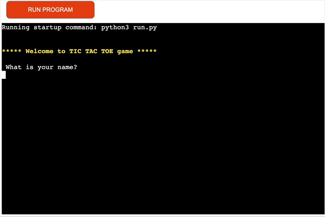

# TIC TAC TOE Game

Welcome! If you are here it means you are an old school game player. There's nothing more nostalgic for a true old school player than returning to a terminal game and having to enter your desired output in order for it to be generated. That's just what this game of Tic Tac Toe does.

## [Visit the deployed game on Heroku](https://tic-tac-toe-crs-game-aa9dec7c85f2.herokuapp.com/)

## Contents

- [User Experience]()
  - [External user's goals]()

- [Design]()
  - [Colours]()
  - [Lucidchart]()
  - [Features]()
    - [Intro]()
    - [Instructions]()
    - [Live game]()
    - [Win Messages]()
    - [Exit messages]()
    - [Error messages]()
- [Technologies used]()
  - [Languages used]()
  - [Frameworks, Libraries & Programs Used]()
- [Deployment & Local Development]()
  - [Deployment]()
  - [Local Development]()
- [Testing]()
  - [Solved Bugs]()
  - [Automated testing]()
  - [Manual testing]()
- [Credits]()  

