# TIC TAC TOE Game

Welcome! If you are here it means you are an old school game player. There's nothing more nostalgic for a true old school player than returning to a terminal game and having to enter your desired output in order for it to be generated. That's just what this game of Tic Tac Toe does.

## [Visit the deployed game on Heroku](https://tic-tac-toe-crs-game-aa9dec7c85f2.herokuapp.com/)

## Contents

- [User Experience](#user-experience)
  - [External user's goals](#external-users-goals)

- [Design](#design)
  - [Colours](#colours)
  - [Lucidchart](#lucidchart)

  - [Features](#features)
    - [Intro](#intro)
    - [Instructions](#instructions)
    - [Live game](#live-game)
    - [Win Messages](#win-messages)
    - [Exit messages](#exit-messages)
    - [Error messages](#error-messages)

- [Technologies used](#technologies-used)
  - [Languages used](#languages-used)
  - [Frameworks, Libraries & Programs Used](#frameworks-libraries--programs-used)

- [Deployment & Local Development](#deployment--local-development)
  - [Deployment](#deployment)
  - [Local Development](#local-development)

- [Testing](#testing)
  - [Solved Bugs](#solved-bugs)
  - [Automated testing](#automated-testing)
  - [Manual testing](#manual-testing)

- [Credits](#credits)  

---

## User Experience

Tic tac toe, known as well as noughts and crosses or Xs and Os, is a game in which two players alternately use X or O to designate the spaces on a three-by-three grid. The winner is the first player to place three of their markers in a row, either diagonally, vertically, or horizontally. The game is solved, and a forced draw is assumed if both players play to their best abilities.

### External user's goals

- The goal of this program is to play a game of Tic Tac Toe against the computer.
- Easily navigate commands and interface.
- Having the ability to play the game for as many time as they want.
- Being able to exit the game after one play, or even before starting playing.
- Be notified if any input errors, and chance to try again.

## Design

### Colours

- In order to offer a better User Experience to my players I have used [Colorama](https://pypi.org/project/colorama/) to get my error messages coloured as well as titles, boards and other messages.

### LucidChart

To create the structure of the game I have used [LucidChart](https://www.lucidchart.com/pages?gad_source=1&gclid=CjwKCAjwktO_BhBrEiwAV70jXjhVg-Pgptxplfz9sk23491hfsAiKq-7vOBL0ne-KT04D288DShZFhoCRR4QAvD_BwE&km_CPC_AdGroupID=161577849299&km_CPC_AdPosition=&km_CPC_CampaignId=21219128573&km_CPC_Country=1006790&km_CPC_Creative=697352222067&km_CPC_Device=c&km_CPC_ExtensionID=&km_CPC_Keyword=block%20diagram%20tool&km_CPC_MatchType=b&km_CPC_Network=g&km_CPC_TargetID=kwd-2325717496&km_CPC_placement=&km_CPC_target=&utm_campaign=_chart_en_tier1_desktop_search_nb_broad_ltv204&utm_medium=cpc&utm_source=google ) and managed to get the following:

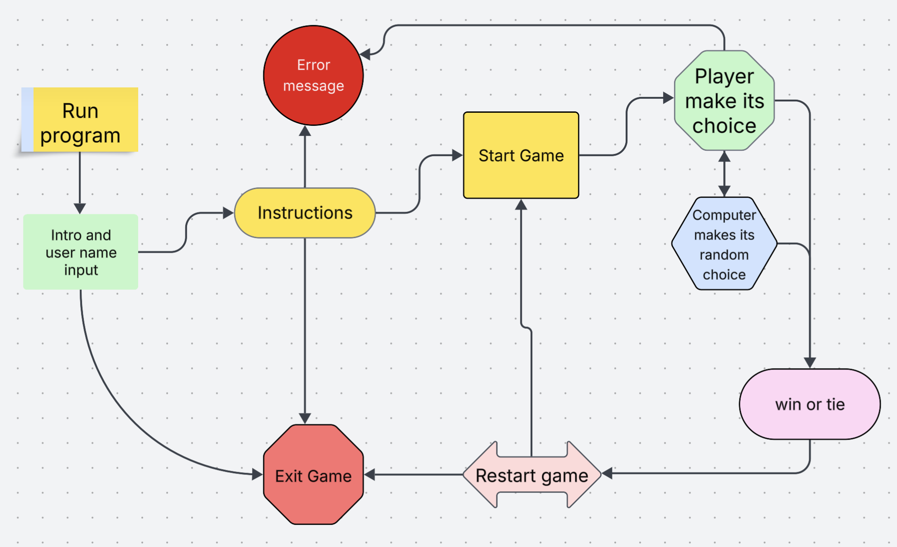

## Features

### Intro

Game opens with a welcome message and input for user name. After input is valid, continuation is required as per below image.

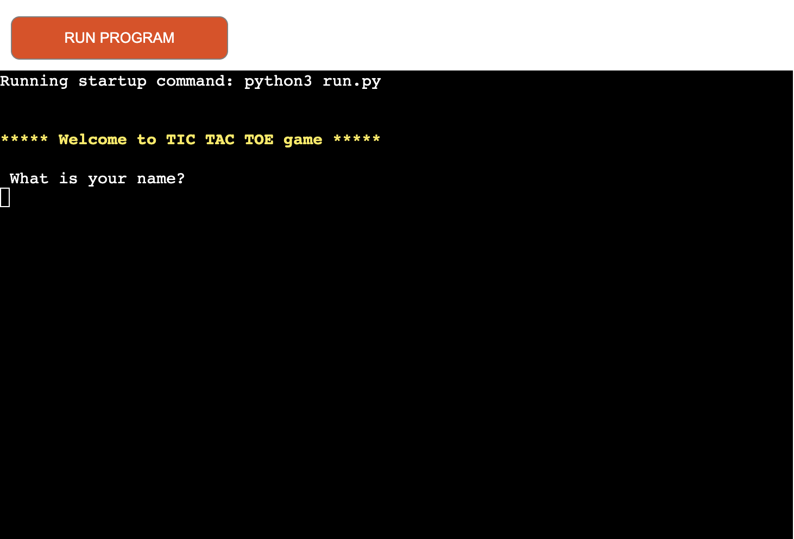

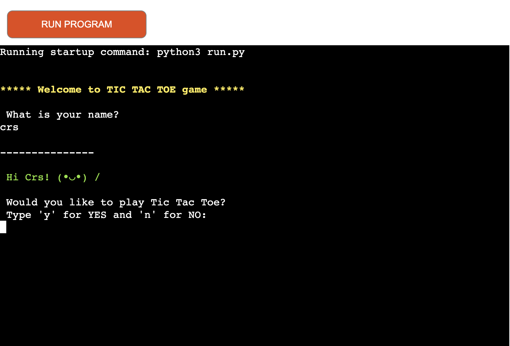

### Instructions

If user chooses to continue, terminal gets cleared and instructions info comes up.

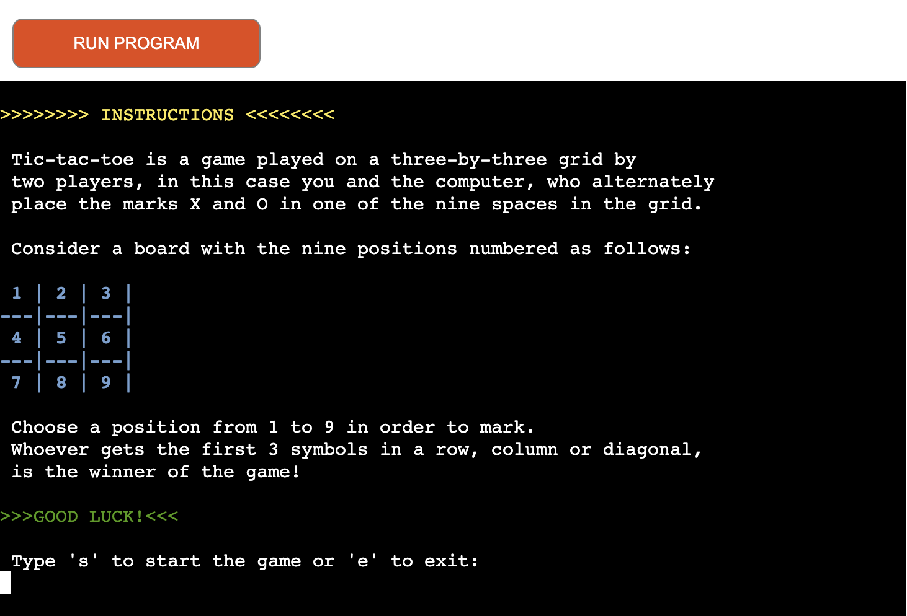

### Live game

If the user chooses to continue towards starting playing the game, the terminal gets cleared and Live game board with reference board appears for the players.

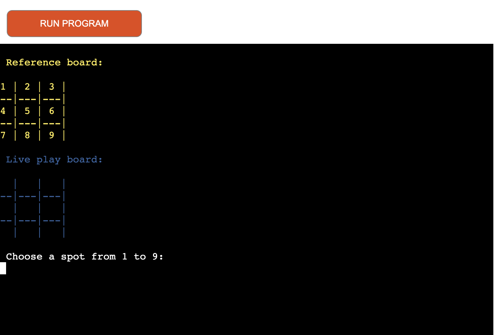

### Win Messages

If the user wins the game, the following message comes up, also with option to play again or exit the game.

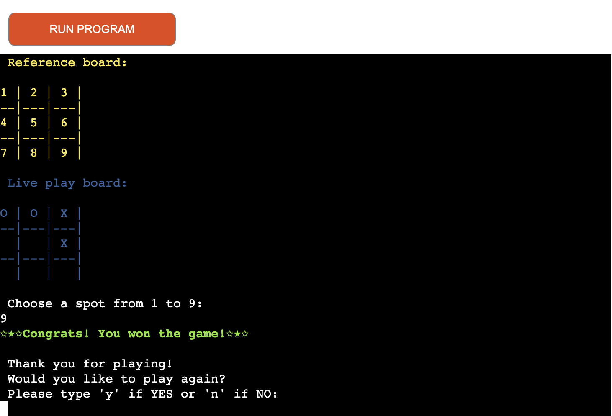

If computer wins, the following message comes up, also with option to play again or exit the game.

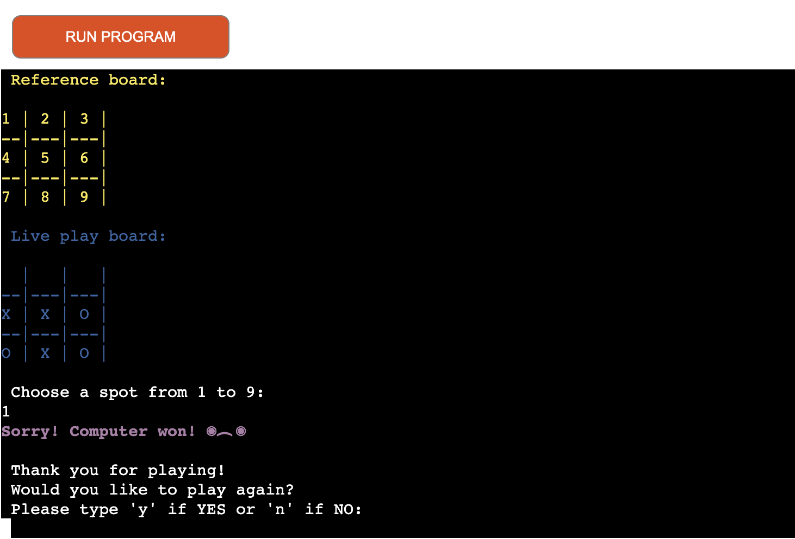

If no winner, the following message comes up, also with option to play again or exit the game.

### Exit messages

In the game the user will have the option to exit before instructions, after, and after playing a game. 

- The following message comes up after exiting intro and instructions:

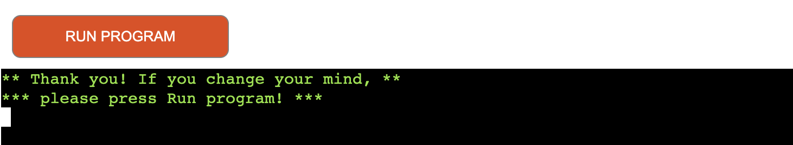

- And the following after quiting a game played:

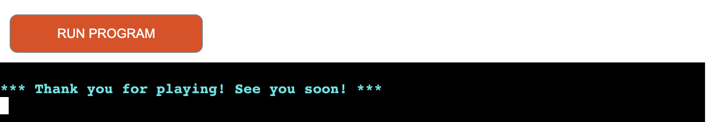

### Error messages

- The user needs to know if any input at any stage of the game, is invalid. I have made sure validation is present at all moment if wrong input provided.

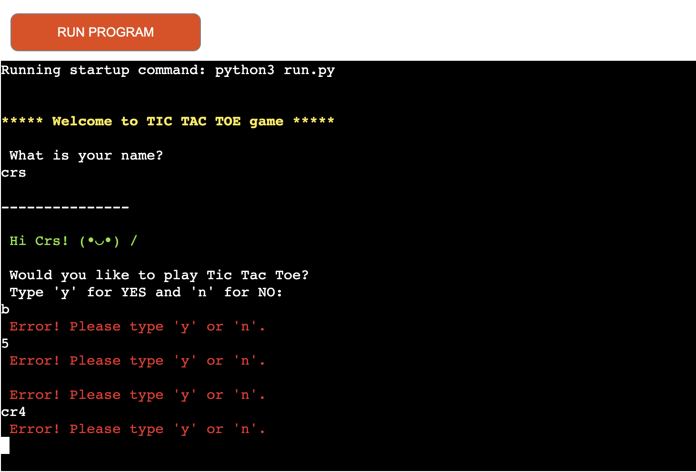

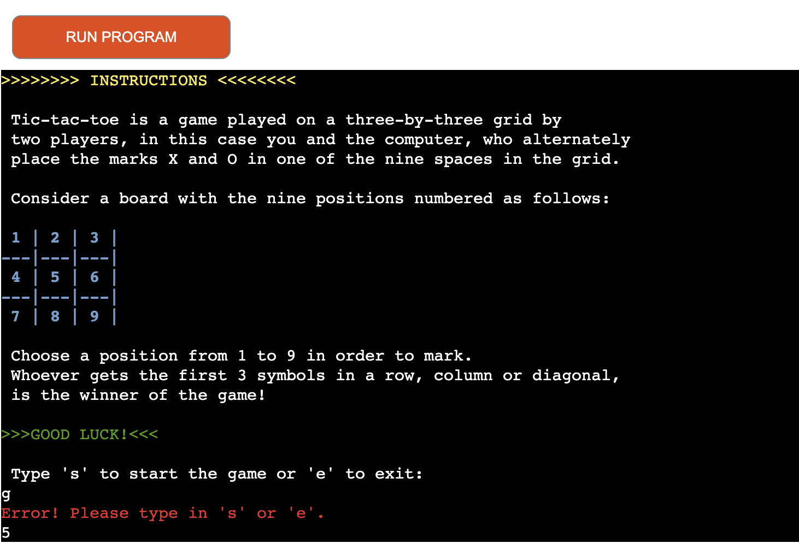

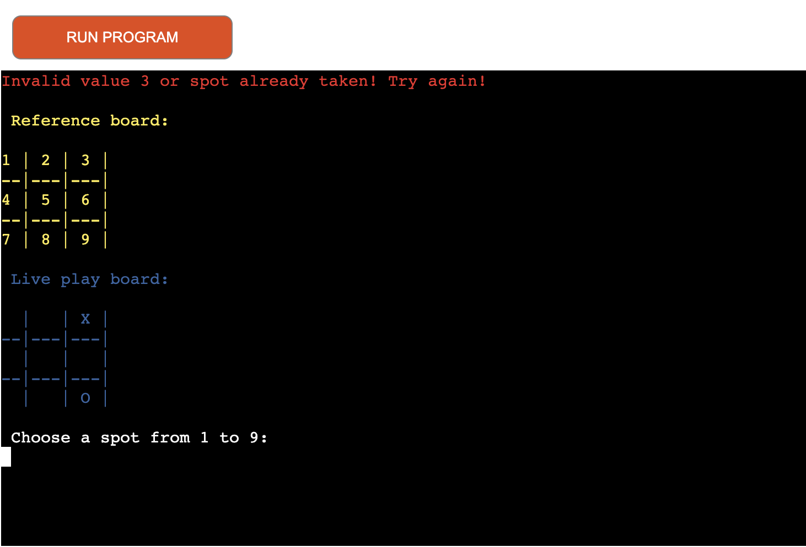

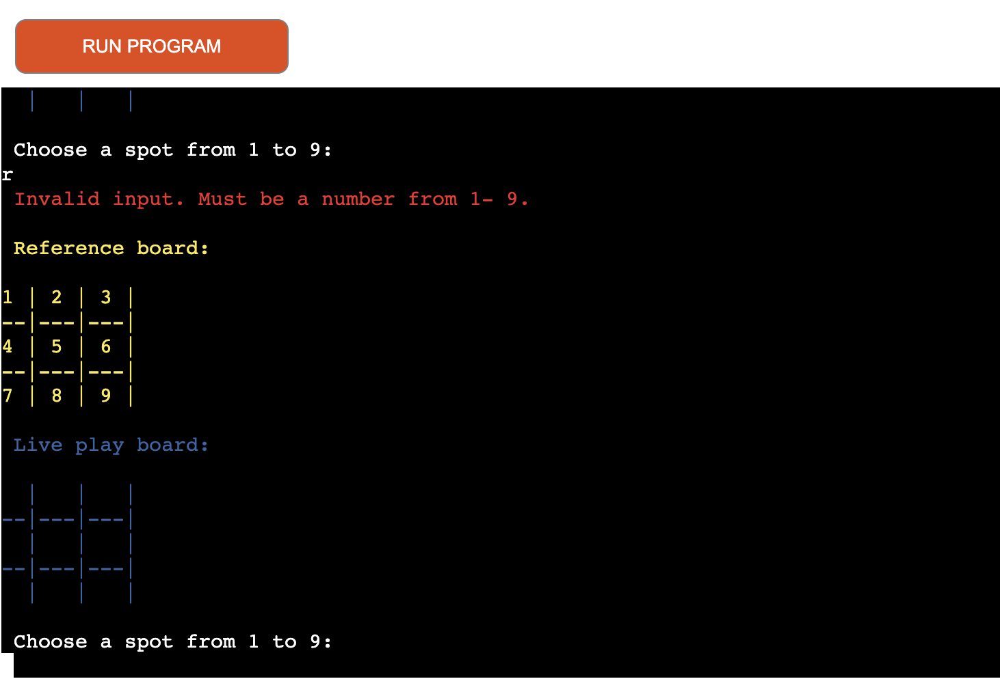

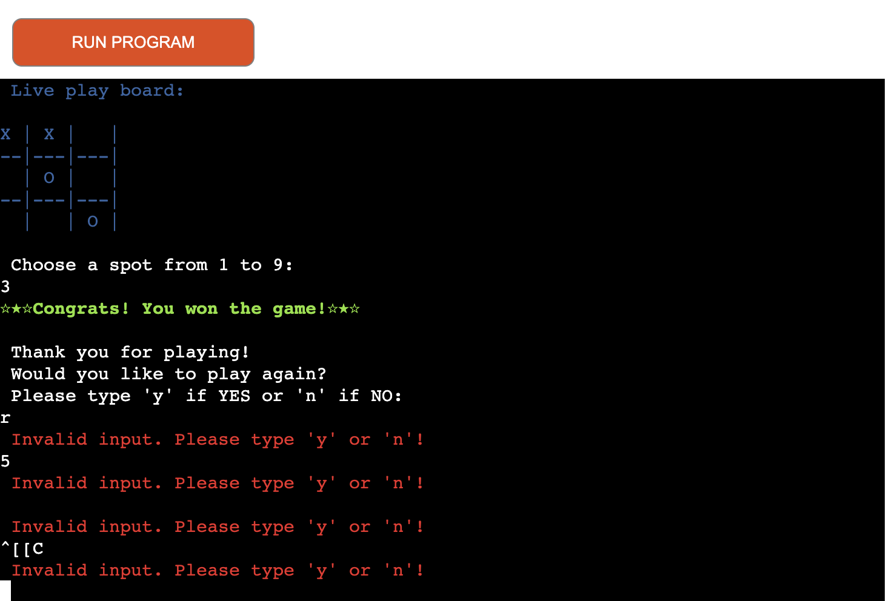

## Technologies used

### Languages used

- Python

### Frameworks, Libraries & Programs Used

- [Github](https://github.com/) - To save and store the files for the website
- [Visual Studio Code](https://code.visualstudio.com/) - IDE used to create the game
- [Birme](https://www.birme.net/) - To convert video to gif.
- [Heroku](https://www.heroku.com/github-students/signup) - to deploy the game for users to play

## Deployment & Local Development

### Deployment

- GitHub Deployment:
1. Log in (or sign up) to Github.
2. Find the repository for this project, Test your Functioning Legal Knowledge.
3. Click on the Settings link.
4. Click on the Pages link in the left hand side navigation bar.
5. In the Source section, choose main from the drop down select branch menu. Select Root from the drop down select folder menu.
6. Click Save. Your live Github Pages site is now deployed at the URL shown.

- Heroku Deployment:
1. Log in (or sign up) to Heroku.
2. Click Create app
3. Create an unique name for your project and choose Europe as zone.
4. Go to Settings 
5. In the Buildpacks section add:
    - heroku/python
    - heroku/nodejs
   Must be in this order!
6. In Config Vars all hiddens files in gitignore, must be added here, plus Key: PORT, Value: 8000.
7. Go to Deploy
8. Choose GitHub, connect and choose repo.
9. You have the option to manual deploy or automatic deploy.

### Local Development

To fork the repository:

1. Log in (or sign up) to Github.
2. Go to the repository for this project, [CristianaDvD/tic-tac-toe](https://github.com/CristianaDvD/Tic_Tac_Toe)
3. Click the Fork button in the top right corner.

To clone the repository:

1. Log in (or sign up) to GitHub.
2. Go to the repository for this project, [CristianaDvD/tic-tac-toe](https://github.com/CristianaDvD/Tic_Tac_Toe)
3. Click on the code button, select whether you would like to clone with HTTPS, SSH or GitHub CLI and copy the link shown.
4. Open the terminal in your code editor and change the current working directory to the location you want to use for the cloned directory.
5. Type 'git clone' into the terminal and then paste the link you copied in step 3. Press enter.

## Testing 

Every step of the development process was subject to ongoing testing.

### Solved bugs

- Game board wouldn't get marked. I solved this issue by calling the type_choice function in the print_game function.
- After player X marked, the game wouldn't switch the player. I solved this issue by calling switch_player function in the type_choice function.
- After a cross was done, game would not declare winner or tie. Solved this issue by calling the declare_win function after every movement on the board.
- An index error was coming up now and then when playing. Solved the issue by changing the randint() from 1, 9 to 0, 8.

### Automated testing

[CI Python Linter](https://pep8ci.herokuapp.com/) was used to test the code of this game. No errors or issues were shown.

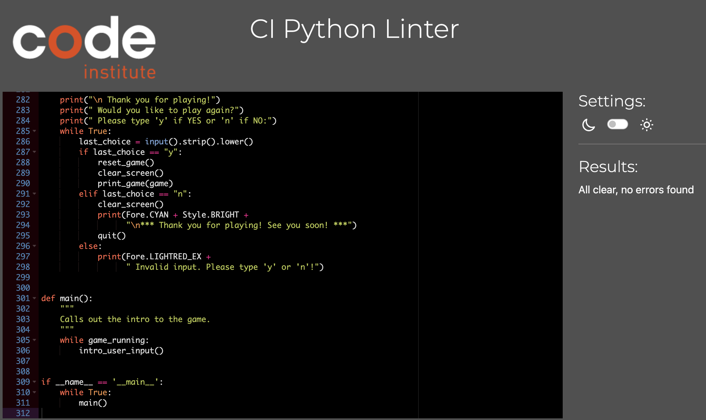

### Manual testing

| Feature | Expected Outcome | Testing Performed | Result | Pass/Fail |
| --- | --- | --- | --- | --- |
| The intro info | Opens up as expected | Run the program | First thing the users sees when running the program | Pass |
| Validation name input | Throw error if input not only letters | Typed numbers in | Error message comes up and input to be provided again | Pass |
| Instructions | To get a clear screen and instructions to open after user chooses to continue | Typed "y" in the terminal | Instructions appear in the terminal with previous screen cleared | Pass |
| Validation choice input (Instructions)| Throw error if wrong input | Typed any other letter/ number/ symbol than required | Error message appears in the terminal with option to try again | Pass |
| Live game | Clear screen and game to start | Typed "s" in the terminal | Game starts and previous screen cleared | Pass |
| Validation | Error message to come up if input is out of range or if any other than the integers required | Typed in wrong values | Different error messages appear with the option to try again | Pass |
| Switch user | After X marks, computer makes its choice, and vice-versa | Played the game against the computer | Board gets marked correctly | Pass |
| Show winner or tie | After a cross has been done winner message or tie message should appear on the screen with the option to play again or no | Played the game until met all possible matches | Winner/Tie messages appear in the terminal with the option to play again or no | Pass |
| Validation Play again! | If wrong value input provided, error message to come up | Provided wrong input | Error message comes up, with the option to try again | Pass |
| Play again | Game board should reset and game to restart | Typed "y" in the terminal | Game board resets and game restarts | Pass |
| Quit the game | If users chooses to exit the program in all stages provided possible, Thank you message should appear in the terminal | Chose to not play again or to not continue | Thank you message displayed in the terminal | Pass |

## Credits

- I would like to give Credits firstly to my mentor Graeme Taylor for all his support and guidance thru all my projects.
- [Code inspiration](https://stackoverflow.com/questions/2084508/clear-the-terminal-in-python) to get screen clear after inputs for better UX.
- [Wikipedia](https://en.wikipedia.org/wiki/Tic-tac-toe) for info presented in instructions.
- [Symbols](https://symbolonly.com/star-symbols.html) used in my win messages, as well as hello from intro.
- [Code Institute](https://codeinstitute.net/global/?utm_term=code%20institute&utm_campaign=CI%20-%20UK%20-%20Search%20-%20Brand&utm_source=adwords&utm_medium=ppc&hsa_acc=8983321581&hsa_cam=1578649861&hsa_grp=62188641240&hsa_ad=635720257674&hsa_src=g&hsa_tgt=kwd-319867646331&hsa_kw=code%20institute&hsa_mt=e&hsa_net=adwords&hsa_ver=3&gad_source=1&gclid=CjwKCAjwktO_BhBrEiwAV70jXkxFqIydzeMyRxUAyYy2GTw9itwXH1VZscHMOeyZbBK8A5sSaHYlFRoC6zAQAvD_BwE) for the basics in Python learning content.
- Last but not least, I first started with the idea of creating this game with tkinter. I have, later, been attentioned by my mentor that this may not be supported in Heroku and have been quiting the idea. But would like to give credits to [Kenny Yip Coding](https://www.youtube.com/watch?v=nbRpDXV7QDM&t=480s) for my initial project idea. Just in case 

Thank you for playing my game!
